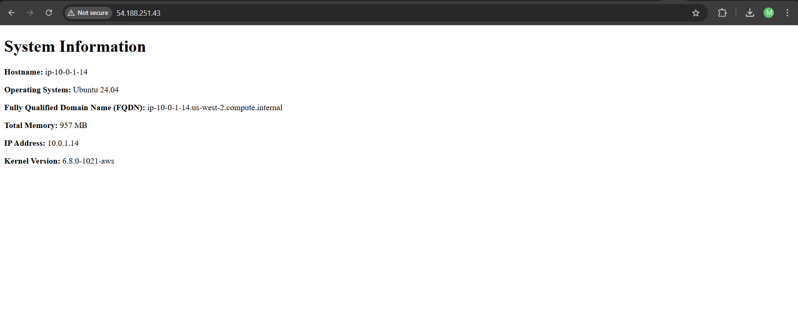

Marcus Su A01382732 and Rafeel Geelani A01364129

# Create ssh key
ssh-keygen -t ed25519 -f ~/.ssh/aws

# import key

./import_lab_key ~/.ssh/aws.pub

# check the syntax of the playbook

ansible-lint playbook.yml

# run the playbook

ansible-playbook playbook.yml

